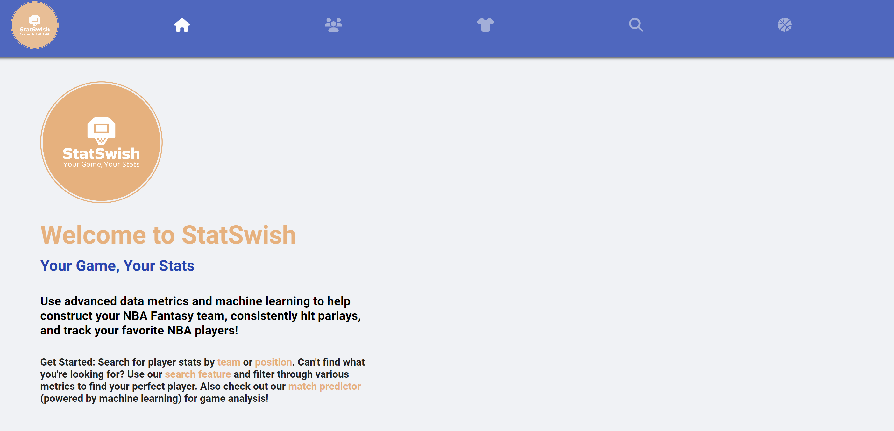

# StatSwish

## Overview

**StatSwish** is a sophisticated full-stack CRUD web application designed to provide comprehensive NBA statistics, advanced data metrics, and AI-driven game analysis. Built for basketball enthusiasts and fantasy sports players, StatSwish delivers real-time data and predictive insights to help users make informed decisions. The platform utilizes a modern tech stack, including ReactJS, Spring Boot, Flask, and machine learning, to create a user-friendly and powerful tool for exploring NBA data.

Users can search for player statistics by team, position, or custom filters, and analyze upcoming games using machine learning predictions. Whether you’re building an NBA Fantasy team, tracking favorite players, or analyzing match-ups, StatSwish provides the data and tools you need. Additionally, StatSwish includes a data scraping component, developed in Python, that scraped data from over 700 NBA players to populate the database with accurate and up-to-date statistics. The front-end is built with ReactJS and styled using SCSS and CSS, ensuring a responsive and visually appealing user interface. The back-end combines the robustness of Spring Boot and the flexibility of Flask to manage data processing, machine learning models, and scalable API services.

## Technologies Used

* **Front-End:** React.js, HTML, SCSS, CSS
* **Back-End:** Spring Boot (Java), Flask (Python), RESTful API, Machine Learning (Python)
* **Data Scraping:** Python (for scraping 700+ NBA players' data)
* **Database:** PostgreSQL
* **Deployment:** Vercel (Front-End), Render (Back-End), Supabase (Database)

## Features & Project Highlights

* **Comprehensive NBA Statistics:** Access extensive NBA player statistics, searchable by team, position, or custom metrics.
* **Advanced Data Metrics:** Utilize detailed data to optimize NBA Fantasy teams, analyze player performance, and enhance betting strategies.
* **Machine Learning Match Predictor:** Leverage AI-driven models to predict game outcomes, offering insights for fantasy sports and betting.
* **CRUD Operations:** Perform Create, Read, Update, and Delete operations to manage NBA data and user preferences seamlessly.
**Data Scraping:** Scraped data for 700+ NBA players using Python to ensure the platform is populated with accurate and current information.
* **Responsive and Stylish User Interface:** Experience a consistent and visually appealing design across all devices, using SCSS and CSS for styling.
* **Robust Back-End Architecture:** Utilize a dual-framework back-end with Spring Boot handling core application logic and Flask managing AI models and specific API endpoints.
* **Search & Filter Capabilities:** Easily locate players and stats using an intuitive search bar with 15+ advanced filtering options.

